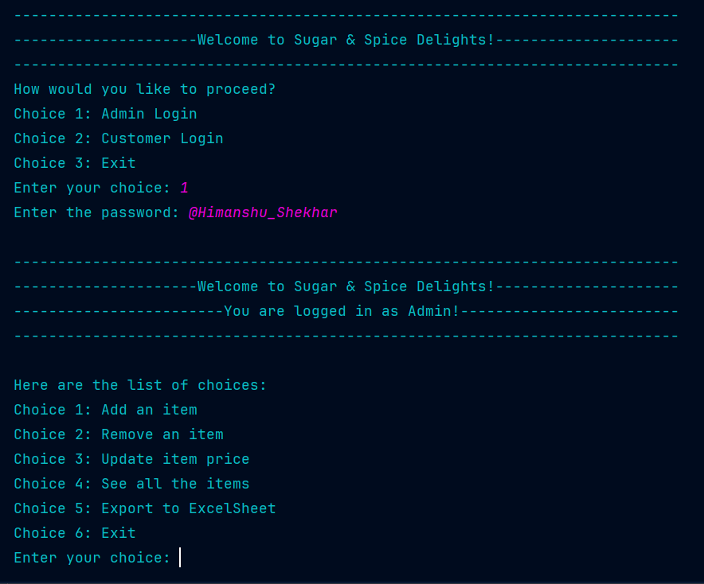

# Bakery Food Ordering System

## Overview

Bakery Food Ordering System is a Python program designed to streamline the ordering process for a bakery. It offers a user-friendly interface for both administrators and customers. Administrators can manage the menu and orders, while customers can conveniently place and track their orders.

## Prerequisites

Make sure you have the following installed:

- **Python 3.11**
- Required Python packages (install using `pip install -r requirements.txt`):
  - `sqlite3`
  - `pandas`
  - `nexmo`
  - `openpyxl`

## Usage

Run the program using the following command:
`python your_script_name.py`
Follow the on-screen prompts for both admin and customer interactions.

## Configuration

Before running the program, make sure to set your Nexmo credentials in the code:

```python
# Your Nexmo credentials
nexmo_api_key = 'your_api_key'
nexmo_api_secret = 'your_api_secret'
nexmo_phone_number = 'your_phone_number'
```
If you don't have your `nexmo_api_key = 'your_api_key'` `nexmo_api_secret = 'your_api_secret'` `nexmo_phone_number = 'your_phone_number'` than you click the given link https://www.vonage.com/communications-apis/ . Create your account first and get `nexmo_api_key` `nexmo_api_secret` `nexmo_phone_number` .

## Features

- Admin Section :
  - Add, remove, or update menu items.
      
        Administrators can easily modify the bakery's menu by adding new items, removing existing ones, or updating prices.

  - View the list of menu items.

        Display a comprehensive list of all available items on the menu, making it convenient for administrators to review and manage.
  
  - Export orders to an Excel sheet.

        Admins can export order details to an Excel sheet for better organization and record-keeping.

- Customer Section :

  - Place orders by selecting items and specifying quantities.

        Customers can easily navigate through the menu, choose their desired items, and specify the quantity for each.
  - Receive order confirmation via SMS.

        Upon placing an order, customers receive a confirmation SMS with relevant details, ensuring a seamless communication process.
  - View and export order details.

        Customers have the option to view their order history and export details for their records.

## Screenshots
Include screenshots to illustrate how the program works.
- Admin Dashboard

- Customer Order Placement

- Billing Details

## Contributing
Contributions are welcome!


## License

This project is licensed under the MIT License - see the [LICENSE](LICENSE) file for details.


Feel free to modify and enhance this README according to your project's specific details and requirements.

## Developer

This program was developed by [Himanshu Shekhar ](https://github.com/Iamhimanshu008). If you have any questions or feedback, feel free to contact the developer.
